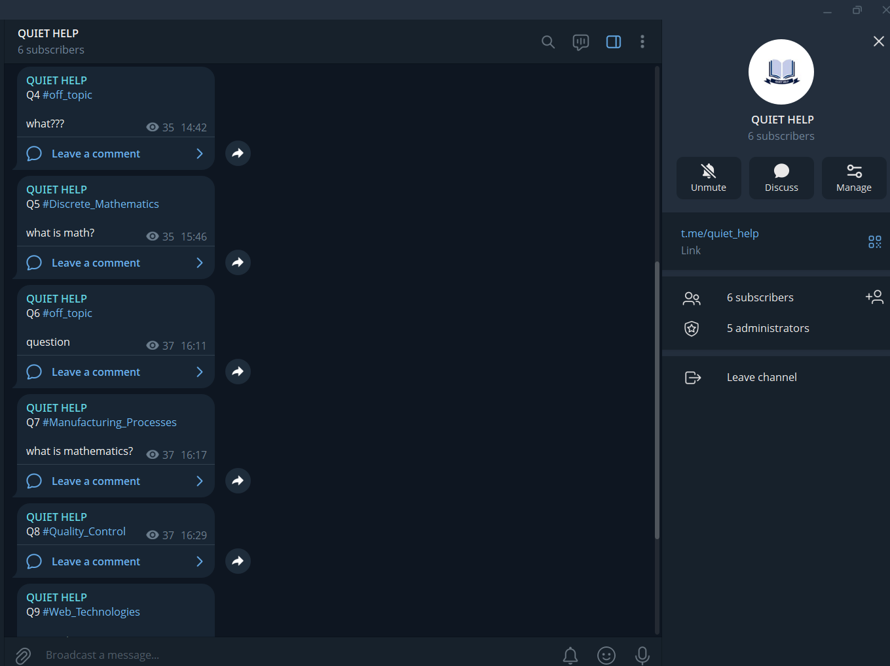

# 🤖 QuietHelpBot

  

QuietHelpBot is a Telegram bot designed to provide helpful responses in a simple and minimal interaction style.  
The project focuses on building conversational bot logic and handling user messages effectively.

## 🔗 Telegram Bot
You can try the bot directly on Telegram:  
👉 @quiet_help_official_bot

## 📸 Screenshots

## 🛠 Technologies Used
- Telegram Bot API  
- Backend logic for message handling  

## 👨‍💻 Author
Ollayorbek Masharipov  
GitHub: https://github.com/ollayorbek0833  
Email: ollayorbek2005@gmail.com
